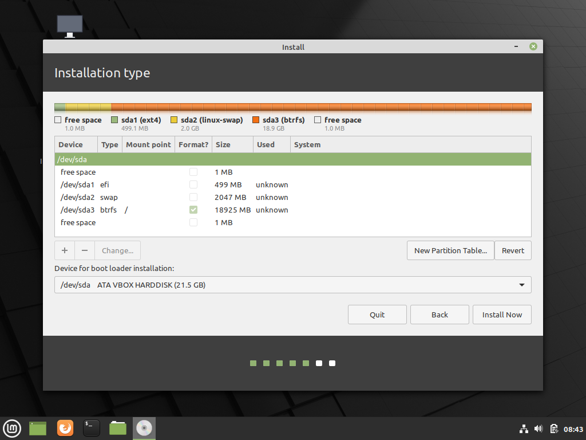

使用 Btrfs 作為你的桌面檔案系統

- Btrfs 的功能
  - Subvolume 取代分割區，空間充分利用
  - Snapshot 瞬間快照，系統弄壞沒煩惱
  - 從快照開機，開啟平行宇宙
- 實作練習（Mint VM）
  - Subvolume 分割教學
  - 系統安裝後的 Timeshift 設定
  - grub-btrfs 設定由快照開機

## Btrfs — Linux 的新世代檔案系統

在 Linux 中，我們經常透過分割硬碟來分離檔案系統，最常見的就是分出 /, /home, /boot 三者，如此的好處是未來重灌系統時，家目錄（/home）的檔案不會被影響，但壞處是硬碟空間較沒彈性，沒有辦法充分利用硬碟空間，在寸土寸金的 SSD 上此問題更是明顯。

傳統上的作法可透過 LVM — 邏輯磁區管理來克服，但管理上仍然有難度。近年來也出現了新興的選項 — Btrfs，有著許多優秀的功能，其中我今天將介紹 subvolume 與 snapshot 這兩個功能以及使用示範。

### Subvolume

Subvolume — 子卷是 Btrfs 中類似分割區的結構，每個 subvolume 都有獨立的檔案樹，因此不同 subvolume 可以被分離，在重灌時也可以單獨刪除子卷，因此就可以用子卷來取代分割區。所有子卷共用硬碟空間，因此不會有分割區的空間浪費，可以完整的運用你的每一吋硬碟。

### Snapshot

Snapshot — 快照是 Btrfs 最為人稱道的功能之一，你可以透過 Btrfs 建立 Copy on Write 的快照，這是什麼意思呢？

我們平常做備份，都必須將整個檔案系統複製出來，好一點的可以做差異備份，只複製更動的部份，但不論哪種都相當費時。Copy on Write 則是在你建立 Snapshot 的時候先將檔案系統的「狀態」記錄下來，當你修改了檔案，要寫入系統時，Btrfs 再將舊的檔案存到 Snapshot 中，因此建立快照基本上是瞬間完成，並且將複製檔案的成本分攤到未來寫入檔案的時候，因此做備份不再是件辛苦的事了。

Btrfs 的快照本身就是一個 Subvolume，而且還是可修改的，這意味著什麼呢？你可以用**快照開機**！假設某一天我要試用一個不穩定的軟體，可能會破壞我的系統，那我就先建立快照，然後用快照開機。如果系統真的壞了，那我只要切換回原本的 Subvolume 開機就好。**Btrfs 讓你的系統成為一個大型版本控制系統！**

## Linux Mint 安裝範例

版本：Linux Mint 20

運行於 Virtualbox，EFI 模式。

執行 Linux Mint 安裝程式，將硬碟分割成下圖所示，其中 Swap 大小可根據個人情況調整。

安裝完畢後重新啟動，