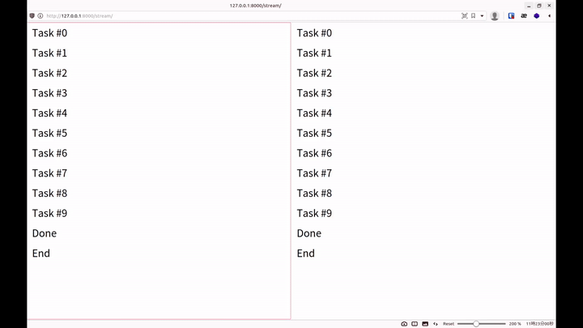

+++
title = "How to Redirect Stdout to Streaming Response in Django"
date = 2021-05-25T11:28:37+08:00
categories = ["English"]
tags = ["Python", "Django", "Threading", "Tutorial"]
draft = true
showToc = true

+++

Sometimes we need to execute some long tasks at the backend, and the tasks are complicated and error-prone. So we hope users can see the real-time console log. Thus we need to redirect the stdout in our functions to the user's browser.

Given a function like the following. How to see the stdout in real-time in the browser?

```python
import time


def job(times):
    for i in range(times):
        print(f'Task #{i}')
        time.sleep(1)
    print('Done')
    time.sleep(0.5)
```



## Streaming Response

Normally, responses are sent after all the data has been collected. However, sometimes we can't wait until the data is prepared. In this case, we'll use **streaming response**. In Django, it's StreamingHttpResponse. I'll call it SHR in the following article. StreamingHttpResponse accepts an iterator for input. It sends the value each time getting a new value from the iterator. To use it, we only need to implement an iterator function. It will send the value from `yield ` to the user's browser in real-time.

```python
# Example of StreamingHttpResponse

from django.http.response import StreamingHttpResponse
def example():
	for i in range(5):
        # Add <br> to break line in browser
		yield f'{i}<br>'

def stream(request):
    return StreamingHttpResponse(example())

```

Output (in browser): 

```
0
1
2
3
4
```

## Threading

As we execute the task and stream output at the same time, we need **concurrence**. In Python, there are multiple choices, like threading, multiprocessing, etc. I'll use threading in this article because it is easier for me.

```python
# Example of threading

from threading import Thread
import time

def example(times):
	for i in range(times):
		print(i)
		time.sleep(1)

# Create Thread
thread = Thread(target=example, args=(5,))

# Start Thread
thread.start()

time.sleep(2)
print("This is printed in the main thread")

# Waiting thread to be done
thread.join()
```

Output:

```
0
1
This is printed in the main thread
2
3
4
```

## Redirect Stdout

To change the location where Python print, we need to change `sys. stdout`. It accepts any File-like object. Specifically, we need to define an object with the `write` method.

```python
# Example of redirect stdout
import sys

class Printer:
    def __init__(self):
        self.contents = []

    def write(self, value):
        self.contents.append(value)

printer = Printer()
sys.stdout = printer

print('This should be saved in printer')

sys.stdout = sys.__stdout__

print('This should be printed to stdout')

print(printer.contents)
```

Output:

```
This should be printed to stdout
['This should be saved in printer', '\n']
```

## Implement Redirecting Stdout to Streaming Response

### Environment

Python 3.8.5

Django 3.2

First, create Django Project

```
pip install django
django-admin startproject console_streaming
cd console_streaming
python manage.py startapp web
```

Install web

```python
# console_streaming/settings.py

INSTALLED_APPS = [
	...
    # Add web
    'web',
]
```

Create a view

```python
# web/views.py

def stream(request):
    # implement later
    pass
```

Bind to URL

```python
# console_streaming/urls.py

from django.urls import path
from web import views

urlpatterns = [
    path('stream/', views.stream),
]
```

### Testing Task

This is the testing function we're going to use. It will repeat printing a line and waiting a second for n times, and then print "Done". 

```python
# web/views.py
import time


def job(times):
    for i in range(times):
        print(f'Task #{i}')
        time.sleep(1)
    print('Done')
    time.sleep(0.5)
```

### Printer class

We implement a Printer class to handle stdout, and we'll only use **one instance** in the whale program life cycle. Because `sys.stdout` does not thread-specific, if we use different stdout in different requests, one would grab stdout from another. So I use a dictionary to store the queue for different threads, and use `current_thread()` to identify and pick the right queue. If the current thread hasn't registered to Printer, use the default stdout.

```python
# web/views.py
from queue import Queue
from threading import current_thread
import sys


class Printer:
    def __init__(self):
        self.queues = {}

    def write(self, value):
        '''handle stdout'''
        queue = self.queues.get(current_thread().name)
        if queue:
            queue.put(value)
        else:
            sys.__stdout__.write(value)

    def flush(self):
        '''Django would crash without this'''
        pass

    def register(self, thread):
        '''register a Thread'''
        queue = Queue()
        self.queues[thread.name] = queue
        return queue

    def clean(self, thread):
        '''delete a Thread'''
        del self.queues[thread.name]
        
# Initialize a Printer instance
printer = Printer()
sys.stdout = printer
```

 ### Streamer class

Next, we're going to implement concurrent execution and streaming response by a Streamer class. It will initialize a thread, and register it to the printer to get a queue. Then it repeats to read the value from queue and yield to response until the thread ends.

```python
from threading import Thread


class Steamer:
    def __init__(self, target, args):
        self.thread = Thread(target=target, args=args)
        self.queue = printer.register(self.thread)

    def start(self):
        self.thread.start()
        print('This should be stdout')
        while self.thread.is_alive():
            try:
                item = self.queue.get_nowait()
                yield f'{item}<br>'
            except Empty:
                pass
        yield 'End'
        printer.clean(self.thread)

def stream(request):
    streamer = Steamer(job, (10,))
    return StreamingHttpResponse(streamer.start())
```

Run Django server

```
$ python manage.py runserver
```

Open http://localhost:8000/stream/

Then you can see


Each time you make a request, you can see one output in the terminal.

```
This should be stdout
```

## Full views.py

```python
from django.http.response import StreamingHttpResponse
from queue import Queue, Empty
from threading import Thread, current_thread
import time
import sys


class Printer:
    def __init__(self):
        self.queues = {}

    def write(self, value):
        '''handle stdout'''
        queue = self.queues.get(current_thread().name)
        if queue:
            queue.put(value)
        else:
            sys.__stdout__.write(value)

    def flush(self):
        '''Django would crash without this'''
        pass

    def register(self, thread):
        '''register a Thread'''
        queue = Queue()
        self.queues[thread.name] = queue
        return queue

    def clean(self, thread):
        '''delete a Thread'''
        del self.queues[thread.name]


printer = Printer()
sys.stdout = printer


class Steamer:
    def __init__(self, target, args):
        self.thread = Thread(target=target, args=args)
        self.queue = printer.register(self.thread)

    def start(self):
        self.thread.start()
        print('This should be stdout')
        while self.thread.is_alive():
            try:
                item = self.queue.get_nowait()
                yield f'{item}<br>'
            except Empty:
                pass
        yield 'End'
        printer.clean(self.thread)


def job(times):
    for i in range(times):
        print(f'Task #{i}')
        time.sleep(1)
    print('Done')
    time.sleep(0.5)


def stream(request):
    streamer = Steamer(job, (10,))
    return StreamingHttpResponse(streamer.start())

```

Complete code on [GitHub](https://github.com/lancatlin/python_console_streaming)

## References

+ [Python Docs: threading](https://docs.python.org/3/library/threading.html#thread-objects)
+ [Python Docs: queue](https://docs.python.org/3/library/queue.html#queue-objects)
+ [Chase Seibert: Redirect console output to a Django HttpResponse](https://chase-seibert.github.io/blog/2010/08/06/redirect-console-output-to-a-django-httpresponse.html)
+ [thread specific sys.stdout?](https://bytes.com/topic/python/answers/36067-thread-specific-sys-stdout)
+ [G. T. Wang: Python 多執行緒 threading 模組平行化程式設計教學](https://blog.gtwang.org/programming/python-threading-multithreaded-programming-tutorial/)
