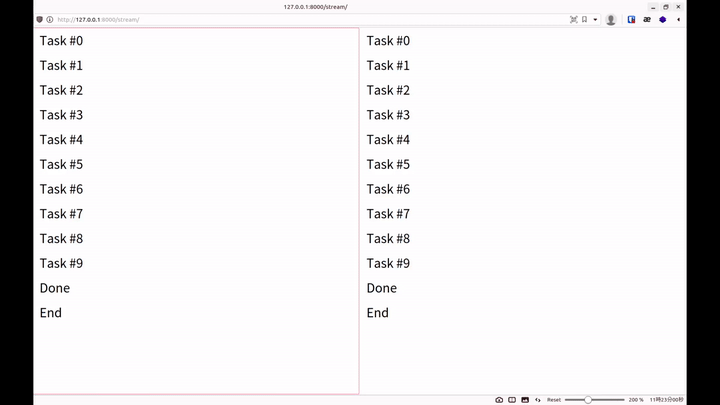

+++
title = "Django 將 Stdout 導向 Streaming Response"
date = 2021-05-25T11:28:37+08:00
categories = ["技術"]
tags = ["Python", "Django", "Threading"]
draft = false
showToc = true

+++

有時候後端要執行一個時間比較長的任務，而任務內容極為複雜，又容易出錯，因此希望讓使用者看到即時的 console log，讓我們函式中的 print 輸出能即時傳到使用者的瀏覽器。



以下將會以 Django, Thread, Queue 進行實做

## StreamingHttpResponse

一般的網頁請求都是一次打包好所有資料，全部傳給使用者，有些情況我們不能等到所有資料準備好才一次傳，而要拿到一些就傳一些，這個時候我們就要使用串流輸出，在 Django 裡，就是使用 StreamingHttpResponse，以下簡稱 SHR。SHR 接收一個 Iterator 作為輸入，因此我們只要實做一個迭代器函式，其中每次 yield 就會由 SHR 傳送到瀏覽器

```python
# Example of StreamingHttpResponse

from django.http.response import StreamingHttpResponse
def example():
	for i in range(5):
        # Add <br> to break line in browser
		yield f'{i}<br>'

def stream(request):
    return StreamingHttpResponse(example())

```

Output (in browser): 

```
0
1
2
3
4
```

## Thread

由於我們的程式需要一邊執行目標任務，一邊串流輸出，因此需要平行化執行。Python 中可以使用 threading, multiprocessing 等方式做平行化執行，本文將使用 threading。

```python
# Example of threading

from threading import Thread
import time

def example(times):
	for i in range(times):
		print(i)
		time.sleep(1)

# 建立 Thread
thread = Thread(target=example, args=(5,))

# 啟動 Thread
thread.start()

time.sleep(2)
print("This is printed in main thread")

# 等待 thread 完成
thread.join()
```

Output:

```
0
1
This is printed in main thread
2
3
4
```

## 重新導向 Stdout

Python 中 print 的輸出稱之為 stdout -- Standard Output 標準輸出，簡單來說就是輸出到終端機的內容。要改變 print 的輸出位置，我們就要改變 sys.stdout 這個變數，stdout 可以接受任何 File-like 的物件，具體而言就是實做了 `write` 方法的物件。

```python
# Example of redirect stdout
import sys

class Printer:
    def __init__(self):
        self.contents = []

    def write(self, value):
        self.contents.append(value)

printer = Printer()
sys.stdout = printer

print('This should be saved in printer')

sys.stdout = sys.__stdout__

print('This should be printed to stdout')

print(printer.contents)
```

Output:

```
This should be printed to stdout
['This should be saved in printer', '\n']
```

## 實做串流輸出 Stdout

### 環境

Python 3.8.5

Django 3.2

首先建立一個 Django Project

```
pip install django
django-admin startproject console_streaming
cd console_streaming
python manage.py startapp web
```

安裝 web：

```python
# console_streaming/settings.py

INSTALLED_APPS = [
	...
    # 加入 web
    'web',
]
```

建立 view：

```python
# web/views.py

def stream(request):
    # 待會實做
    pass
```

綁定到 urls：

```python
# console_streaming/urls.py

from django.urls import path
from web import views

urlpatterns = [
    path('stream/', views.stream),
]
```

### 測試函式

這是我們用來模擬目標任務函式，重複 times 次的 print 出一行字，並等待一秒，最後 print 出 "Done"。

```python
# web/views.py
import time


def job(times):
    for i in range(times):
        print(f'Task #{i}')
        time.sleep(1)
    print('Done')
    time.sleep(0.5)
```

### Printer class

以下實做一個 Printer 來處理**所有**的 stdout，並且整個程式生命週期只用一個 instance，原因是 sys.stdout 是不分 thread 的，因此如果不同的 request 使用不同的 printer，會搶走別人的 stdout。因此我使用一個 map 來儲存不同 thread 的 queue，並用 current_thread() 來判斷當前的 thread 取出正確的 queue。而假如當前的 thread 沒有註冊到 Printer，則使用 stdout 輸出。

```python
# web/views.py
from queue import Queue
from threading import current_thread
import sys


class Printer:
    def __init__(self):
        self.queues = {}

    def write(self, value):
        '''handle stdout'''
        queue = self.queues.get(current_thread().name)
        if queue:
            queue.put(value)
        else:
            sys.__stdout__.write(value)

    def flush(self):
        '''Django would crash without this'''
        pass

    def register(self, thread):
        '''註冊一個 Thread'''
        queue = Queue()
        self.queues[thread.name] = queue
        return queue

    def clean(self, thread):
        '''刪除一個 Thread'''
        del self.queues[thread.name]
        
# 初始化一個 Printer instance
printer = Printer()
sys.stdout = printer
```

 ### Streamer class

接下來要實做併發執行以及回傳 StreamingHttpResponse，我將併發執行的部份寫成一個 Streamer class，其會初始化一個 Thread，將其註冊到 printer 取得 queue，接著不斷讀取 queue 的內容，將內容 yield 到 StreamingHttpResponse，直到 thread 結束。

```python
from threading import Thread


class Steamer:
    def __init__(self, target, args):
        self.thread = Thread(target=target, args=args)
        self.queue = printer.register(self.thread)

    def start(self):
        self.thread.start()
        print('This should be stdout')
        while self.thread.is_alive():
            try:
                item = self.queue.get_nowait()
                yield f'{item}<br>'
            except Empty:
                pass
        yield 'End'
        printer.clean(self.thread)

def stream(request):
    streamer = Steamer(job, (10,))
    return StreamingHttpResponse(streamer.start())
```

執行 Django

```
$ python manage.py runserver
```

打開 http://localhost:8000/stream/

就能看到像是以下的輸出


而每新增一個請求，終端機就可以看到一行

```
This should be stdout
```

## 完整 views.py

```python
from django.http.response import StreamingHttpResponse
from queue import Queue, Empty
from threading import Thread, current_thread
import time
import sys


class Printer:
    def __init__(self):
        self.queues = {}

    def write(self, value):
        '''handle stdout'''
        queue = self.queues.get(current_thread().name)
        if queue:
            queue.put(value)
        else:
            sys.__stdout__.write(value)

    def flush(self):
        '''Django would crash without this'''
        pass

    def register(self, thread):
        '''註冊一個 Thread'''
        queue = Queue()
        self.queues[thread.name] = queue
        return queue

    def clean(self, thread):
        '''刪除一個 Thread'''
        del self.queues[thread.name]


printer = Printer()
sys.stdout = printer


class Steamer:
    def __init__(self, target, args):
        self.thread = Thread(target=target, args=args)
        self.queue = printer.register(self.thread)

    def start(self):
        self.thread.start()
        print('This should be stdout')
        while self.thread.is_alive():
            try:
                item = self.queue.get_nowait()
                yield f'{item}<br>'
            except Empty:
                pass
        yield 'End'
        printer.clean(self.thread)


def job(times):
    for i in range(times):
        print(f'Task #{i}')
        time.sleep(1)
    print('Done')
    time.sleep(0.5)


def stream(request):
    streamer = Steamer(job, (10,))
    return StreamingHttpResponse(streamer.start())

```

完整程式碼：[GitHub](https://github.com/lancatlin/python_console_streaming)

## References

+ [Python Docs: threading](https://docs.python.org/3/library/threading.html#thread-objects)
+ [Python Docs: queue](https://docs.python.org/3/library/queue.html#queue-objects)
+ [Chase Seibert: Redirect console output to a Django HttpResponse](https://chase-seibert.github.io/blog/2010/08/06/redirect-console-output-to-a-django-httpresponse.html)
+ [thread specific sys.stdout?](https://bytes.com/topic/python/answers/36067-thread-specific-sys-stdout)
+ [G. T. Wang: Python 多執行緒 threading 模組平行化程式設計教學](https://blog.gtwang.org/programming/python-threading-multithreaded-programming-tutorial/)

