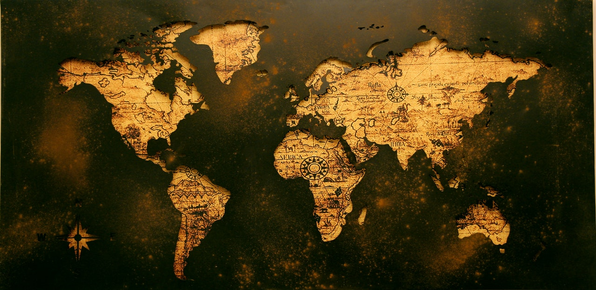

Photo by **[Aaditya Arora](https://www.pexels.com/@aaditya-arora-188236?utm_content=attributionCopyText&utm_medium=referral&utm_source=pexels)** from **[Pexels](https://www.pexels.com/photo/world-map-illustration-592753/?utm_content=attributionCopyText&utm_medium=referral&utm_source=pexels)**

這個標題也許令人誤解，1/1 本來就是一年的開始啊？當然，但為什麼我們會選擇一個冬天的日子作為一年的開始，而不是某個春天、夏天、秋天的日子呢？陽曆以地球的公轉為依循，地球每繞太陽一圈就是一年，一年之中所謂「特別」的日子，應該會是春分、夏至、秋分、冬至等等，但 1/1 卻不是什麼特別的日子，甚至以季節來說，我們通常會認為 12、1、2 月是冬天，3 月開始才是春天，為什麼會將新年定在一個季節的「中間」呢？

下一個猜想：也許是由於某種歐洲世界的歷史因素？直覺會想到的可能是「耶穌誕生」，畢竟西元的紀年「名義上」就是以耶穌誕生為始（儘管這與史實有些差距），但這也有矛盾之處：我們之所以能說「耶穌於 12/25 日出生」，就證明了陽曆是早於耶穌誕生的，否則就應該會是「我們將耶穌誕生之日定為 1/1」。

如果把陽曆跟農曆做比較，就會發現這個巧合更加神奇，農曆是以月亮的公轉作為依循，一年的長度與陽曆不盡相同，然而農曆的「新年」和陽曆定在差不多的時間，都是在冬天的中間，但是農曆的新年是有天文意義的，新年之時月亮是朔月，但一年有 12 個月，為什麼不定在其他的月份？不同文化將「新年」這個概念定在差不多的時候，這背後有什麼關聯嗎？

我想到的可能性是**農業社會的生活型態**，在較高緯度的農業社會中，冬天是休耕期，一年到頭的辛勤的工作，在冬天時應當能稍微喘息，而歷經了作物一年的生長與收割，在這個時候特別會有「結束」之感，而實務上來說，若要「慶祝新年」，選擇在冬天的中間進行也很合理，因為工作量比較少，慶祝完後就可以迎接春天的到來，因此自然而然成為了北半球新年的「熱門選擇」。由此推廣，南半球的文明是否也會選擇當地冬天轉春天的時候作為新年呢？

知道為什麼新年要定在冬天了，但是為什麼恰好定在現在的 1/1，而不是早一天或晚一天呢？這聽起來或許強詞奪理，但我們要意識到，人類社會要取得廣泛的共識是很難的，通常能夠廣泛被認可的制度都來自某些自然觀察，例如十進制來自於人類有十根手指、一週七天來自地球上可以肉眼觀察到的「特殊星球」有七顆，否則就是出於歷史因素，並由強勢文化擴散到世界各地。

## 現代公曆的歷史

根據維基百科，我們現今所使用的公曆——**格里曆**，是在公元 1582 年由義大利醫生阿洛伊修斯．里利烏斯改良**儒略曆**所制定、並由教皇所頒布的。其改良內容主要是對閏年規則的修正，沒有改變新年的時間點，因此再往上追，儒略曆是羅馬的羅馬共和國獨裁官**儒略．凱撒**採納希臘數學家索西琴尼所計算出的曆法，在那之前羅馬的曆法相當的混亂，與太陽的公轉週期已經相差甚遠，而 1/1 則是定在凱撒**執政官上任**之日。

我們發現這跟先前的推測相當接近，1/1 的制定是出自歷史因素，且格里曆其實是相當晚期才被全世界採用，日本於 1873 年採用格里曆，而中國則是在中華民國於 1912 年成立後開始採用格里曆，在這個時機做出改變，明顯是來自歐洲強勢文化的影響，這也驗證了我們先前的猜想。

## 現代的不同曆法

其實在現代，也有國家是採取不同的曆法，例如伊朗所使用的伊朗曆，就是以春分作為一年開始的太陽曆（取自天文觀察）；或是許多伊斯蘭國家所使用的伊斯蘭曆，跟中國傳統的農曆一樣是以月亮的公轉作為依循，並將**新月**定為一個月的開始（農曆是朔）。

除此之外，現代也有對曆法改革的提議，對紀年的改革有學者塞薩爾．埃米利安尼提出的**人類紀年**（又稱全新世紀年），將現有的年加上 10000 作為新的紀年，例如 2021 就會變成 12021，選擇這個時間點，是因為人類紀年的元年是最後一次冰河期的結束，也是新石器時代的開端。此外這種曆法包含了 0 年，讓數軸變得完整。

對紀月的改革有企業家喬治．伊士曼所推行的**國際固定曆**，將每個月定為 4 個星期 28 天，一年 13 個月，這樣只有 364 天，因此再添加最後一天「年日」作為一年的結束，年日不屬於星期中的任何一天，國際固定曆的特色是日期將始終落在一週中的同一天，且非常易於計算（除以 7 的餘數）。 

這些提案雖然到現在仍處於討論階段，尚未獲得共識，但打破了我過去對曆法「本來就是這樣」的想法。曆法是一種制度，是由人所制定的，過去曾經歷多次的曆法改革，現今也有不同國家使用著不同的曆法，這些都告訴我們即使像曆法這般有如文化根基的制度，也是可以被改變的。如果是你，會期待什麼樣的曆法呢？

## 參考資料

- [曆法](https://zh.wikipedia.org/wiki/历法)
- [格里曆](https://zh.wikipedia.org/wiki/格里曆)
- [儒略曆](https://zh.wikipedia.org/wiki/%E5%84%92%E7%95%A5%E6%9B%86)
- [伊朗曆](https://zh.wikipedia.org/wiki/%E4%BC%8A%E6%9C%97%E6%9B%86)
- [伊斯蘭曆](https://zh.wikipedia.org/wiki/%E4%BC%8A%E6%96%AF%E5%85%B0%E5%8E%86)
- [國際固定曆](https://zh.wikipedia.org/wiki/%E5%9C%8B%E9%9A%9B%E5%9B%BA%E5%AE%9A%E6%9B%86)
- [人類紀年（全新世紀年）](https://zh.wikipedia.org/wiki/%E5%85%A8%E6%96%B0%E4%B8%96%E7%B4%80%E5%B9%B4)