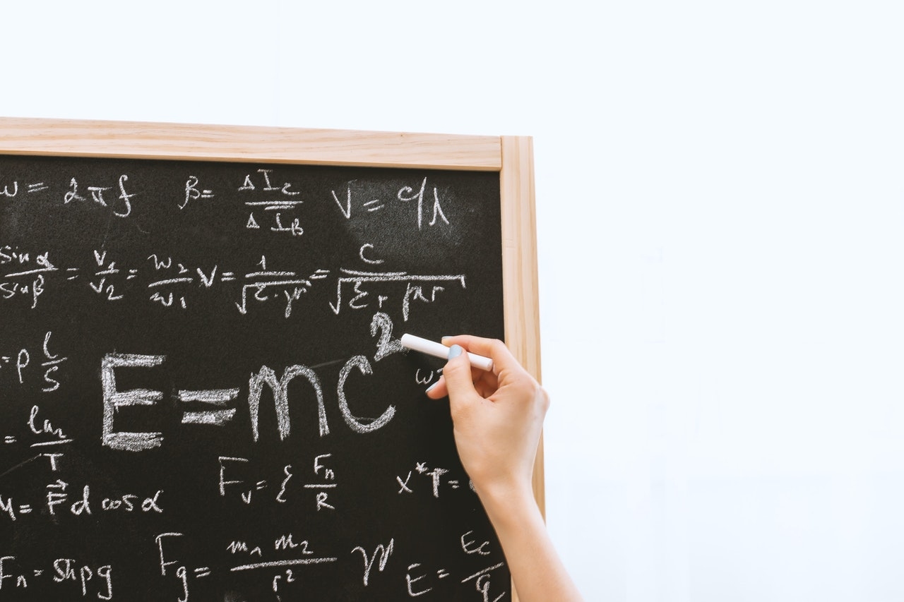

+++
categories = ["每日一問"]
date = "2021-03-07T21:28:38+08:00"
draft = false
showtoc = false
tags = ["物理"]
title = "每日一問：如果世界是個函數"

+++

Photo by **[JESHOOTS.com](https://www.pexels.com/@jeshoots-com-147458?utm_content=attributionCopyText&utm_medium=referral&utm_source=pexels)** from **[Pexels](https://www.pexels.com/photo/person-holding-a-chalk-in-front-of-the-chalk-board-714699/?utm_content=attributionCopyText&utm_medium=referral&utm_source=pexels)**

如果今天有位全知的智者，能夠掌握這個世界上所有物質的狀態，並擁有無窮的算力，能夠推導出下一個瞬間嗎？

假設此推論為真，那代表這個世界可以用一個函數來表示，所有粒子及它們的所有狀態都是這個函數的輸入值，而下一個瞬間的新狀態就是這個函數的輸出值。這個函數的輸出值可以作為下一輪的輸入值，如此重複，我們就可以不停的推算出未來。

函數的定義是：將一個輸入對應到一個唯一的解，也就是說，只要給定了輸入，就能夠確定輸出。因此我們可以從給定的現在，推算出無窮遠的唯一未來。

然而若是每個現在都會對應到唯一的未來，那每個過去也都會導向唯一的現在，因此回推到宇宙的開端，就可以得到一個結論：**現在發生的一切都是在大霹靂時就註定了**，包含你現在看著我寫的這些文字，並對此感到困惑，全都是命中注定的，而無論多久以後的未來，也早已被決定，只是還沒被「執行」出來。那我們所謂的自主意識，也全都只是空談。

這個思想實驗稱之為**拉普拉斯妖**，由 19 世紀數學家皮耶-西蒙·拉普拉斯所提出，是基於古典物理的思想實驗，他的想法核心就是認為世界是可以用一個函數去描述的（那個函數就是牛頓定律），而思想實驗中的智者，就是後人所稱的拉普拉斯妖。

然而這個想法有兩個疑點：首先，假設拉普拉斯妖存在於我們這個宇宙，那它計算未來的行為本身也就改變了這個宇宙，因此它必須計算自己計算了的未來，如此遞迴下去，就造成了一個無窮遞迴，所以它不可能計算出自己所在宇宙的未來。

即便拉普拉斯妖不存在於這個宇宙，而是存在於建立出我們宇宙的母體，它仍然無法計算出下一個瞬間。根據近代的量子力學，由於電子位置的不確定性，我們無法預測物質的下一個狀態。因此我們可以得出結論，世界不是一個函數，**我們的每一個現在，實際上都有著無限的未來**。

這個思想實驗還可以告訴我們，**所有對未來的預測都改變了未來**，馬克思預言了無產階級革命的到來，但他的預言本身也改變了世界，而我們永遠無從得知原本的世界會變得如何。同樣的概念類似於所有的民調都影響了選舉結果，不過天氣預報會不準，應該就不是這個原因了。

## 參考資料

[維基百科：拉普拉斯妖](https://zh.wikipedia.org/zh-tw/%E6%8B%89%E6%99%AE%E6%8B%89%E6%96%AF%E5%A6%96)

