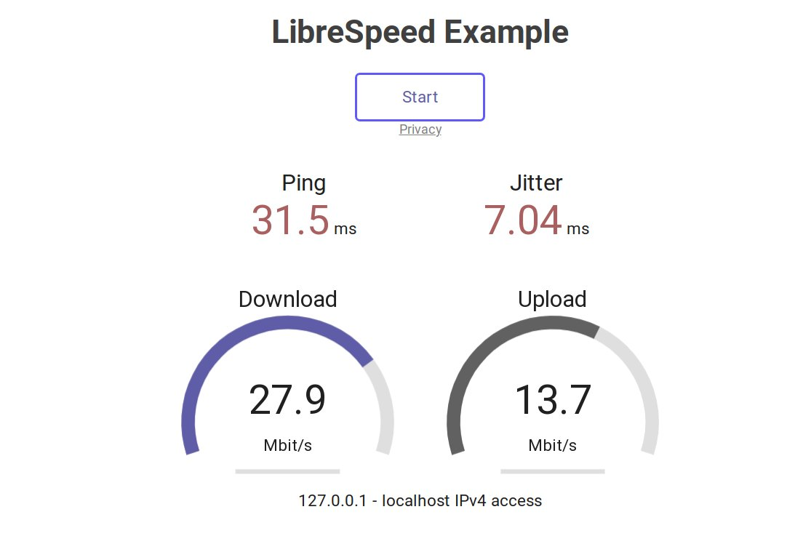
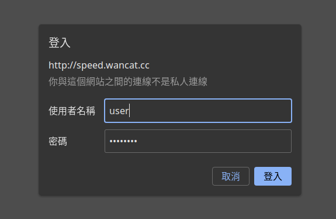

自己架站有時候需要了解伺服器的網速實際上有多快，這時可以在伺服器上安裝 [LibreSpeed](https://github.com/librespeed/speedtest) 這套軟體，打開網頁就能測連線到伺服器的速度。LibreSpeed 有 PHP 和 [Go 實作](https://github.com/librespeed/speedtest-go)，身為 Gopher 當然要用 Go 實作！本篇將以 Go 實作為範例。

## Go 安裝

首先要安裝 Go，到 [Golang 官網](https://golang.org/dl/) 下載你平台的壓縮檔，Raspberry Pi 選 armv6l，一般電腦要選 amd64，然後將其解壓縮：

```
wget https://golang.org/dl/go1.16.7.linux-armv6l.tar.gz
sudo tar -zxvf go1.16.7.linux-armv6l.tar.gz -C /usr/local 
```

將 Go 加到 PATH 中，打開你的 Shell 設定檔（Bash 是 ~/.bashrc，Zsh 是 ~/.zshrc），在最後加入：

```
export PATH=$PATH:/usr/local/go/bin
```

儲存後重開一個 shell，看有沒有成功安裝：

```
$ go version
go version go1.16.7 linux/arm
```

## LibreSpeed 安裝

下載並編繹 LibreSpeed

```
git clone https://github.com/librespeed/speedtest-go.git
cd speedtest-go
go build -ldflags "-w -s" -trimpath -o speedtest main.go
```

程式會編繹成 `speedtest` 執行檔。完成後先打開防火牆的 8989 port：

```
sudo ufw allow 8989
```

接著啟動 LibreSpeed

```
./speedtest
```

在瀏覽器打開 http://<yourdomain.com>:8989，就會出現 LibreSpeed 的畫面了。

## Systemd 設定

現在我們是直接在 terminal 執行，如果要長期執行就要安裝到 Systemd。

```
sudo mkdir /var/lib/speedtest
sudo cp speedtest /var/lib/speedtest
sudo cp -r assets /var/lib/speedtest
sudo cp settings.toml /var/lib/speedtest
sudo chown -R www-data:www-data /var/lib/speedtest
```

建立 systemd 設定檔：

```
sudo vim /etc/systemd/system/speedtest.service
```

```
[Unit]
Description=SpeedTest
After=network.target

[Service]
ExecStart=/var/lib/speedtest/speedtest
WorkingDirectory=/var/lib/speedtest
User=www-data
Group=www-data

[Install]
WantedBy=multi-user.target
```

啟動 Service

```
sudo systemctl daemon-reload
sudo systemctl enable speedtest.service     # 如果要開機自動啟動
sudo systemctl start speedtest.service
sudo systemctl status speedtest.service     # 檢查狀態
```

## Nginx 設定反向代理

每次都要打 port 不好記也不好看，所以我們用 Nginx 來做反向代理，先建立設定檔：

```
sudo vim /etc/nginx/sites-available/speed
```

```
server {
        listen 80;
        listen [::]:80;
        server_name <yourdomain.com>;

        access_log /var/log/nginx/speedtest_access.log;
        error_log /var/log/nginx/speedtest_error.log;

        location / {
                client_max_body_size 50M;
                proxy_set_header Host $host;
                proxy_set_header X-Real-IP $remote_addr;
                proxy_buffering off;
                proxy_pass http://127.0.0.1:8989;
        }
}
```

```
sudo ln -s /etc/nginx/sites-available/speed /etc/nginx/sites-enabled
sudo systemctl reload nginx
```

接下來打開 http://<yourdomain.com> 就可以看到 LibreSpeed 了！

接著我們就可以設定 LibreSpeed 只接受來自 localhost 的連線，來提高安全性：

```
sudo vim /var/lib/speedtest/settings.toml
```

修改以下這行：

```
bind_address="127.0.0.1"
```

重啟 LibreSpeed：

```
sudo systemctl restart speedtest
```

現在再打開 http://<yourdomain.com>:8989，就能看到伺服器拒絕連線，而 http://<yourdomain.com> 則能打開。

那我們就可以把防火牆關回去了：

```
sudo ufw delete allow 8989
```

## Nginx 加上密碼登入

你可能不會希望其他人一直連你的 LibreSpeed 浪費流量，因此我們加上一個簡單的密碼登入：

```
sudo apt install apache2-utils
```

建立密碼檔案：

```
sudo htpasswd -c /etc/nginx/myusers <your username>     # myusers 也可以換成其他的位置
New password:                                           # 密碼都不會顯示
Re-type new password: 
Adding password for user <your username>

cat /etc/nginx/myusers                                  # 查看你的密碼檔案（經過加密）
```

更新 Nginx 設定檔：

```
server {
        listen 80;
        listen [::]:80;
        server_name <yourdomain.com>;

        access_log /var/log/nginx/speedtest_access.log;
        error_log /var/log/nginx/speedtest_error.log;

        location / {
                auth_basic "Please login to continue";      # 登入訊息
                auth_basic_user_file /etc/nginx/myusers;

                client_max_body_size 50M;
                proxy_set_header Host $host;
                proxy_set_header X-Real-IP $remote_addr;
                proxy_buffering off;
                proxy_pass http://127.0.0.1:8989;
        }
}
```

Reload Nginx

```
sudo systemctl reload nginx.service
```

打開網頁，就會出現輸入密碼對話框：



認證成功後就能正常使用了！

## References

* [GitHub: LibreSpeed Go Implement](https://github.com/librespeed/speedtest-go)
* [ShellHacks: Systemd Service File Example](https://www.shellhacks.com/systemd-service-file-example/)
* [LandChads: Requiring Passwords for Webpages](https://landchad.net/auth)


