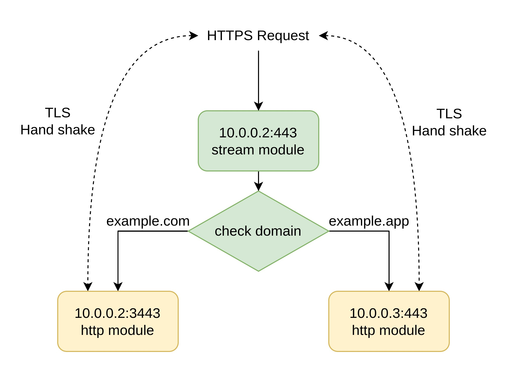

我自己家中的 home lab 是用 Proxmox 安裝的 VM 環境，Proxmox 非常好用，然而有一點非常困擾我：由於我只有一個固定 IP，因此我的不同 domain 都要由同一台 VM 做 reverse proxy。平常這樣用起來沒什麼問題，然而在安裝某些服務，好比 [Jitsi](https://jitsi.org)、[Matrix](https://matrix.org) 時，它會需要存取到 SSL 憑證，因此我得將它放在跟 reverse proxy 同一台 VM 上，否則 Jisti 會讀不到 certbot 產生的憑證。這一直造成我非常大的困擾，直到最近向朋友請教，認識到了 SNI Routing 這項技術。

[SNI](https://en.wikipedia.org/wiki/Server_Name_Indication) 全稱 Server Name Indication，是 TLS 的一個擴充協定，會在客戶端進行連線請求時，附帶 domain name 資訊，用途在於多個 domain name 都指向同一個 IP 地址時，讓伺服器得以判斷要使用哪一個憑證進行連線。Nginx 平常的 Virtual Host 就已經有利用 SNI 的技術了，我們接著還要結合 Nginx 的 stream 功能，來轉發 HTTPS 的 TCP 封包。

Nginx 的 [stream]() 模組能重新導向 TCP 或 UDP 封包，類似 port forwarding 但還是有些不一樣，Nginx 的 stream 會改變封包的來源位址，因此還需要一些設定來還原。 *註：本文目前還沒有處理好轉發 client IP 的問題。*

## 環境設定

OS: Debian 11  
Domain: example.com

我們假設有以下兩台機器

| hostname | ip       | domain      | description           |
| ---      | ---      | ---         | ---                   |
| proxy    | 10.0.0.2 | example.com | reverse proxy machine |
| app      | 10.0.0.3 | example.app | application machine   |

example.com 跟 example.app 都指向同一個 public IP address。我們的目標是，使用 proxy 幫 app 代理 HTTP/HTTPS 流量，且 app 自己用 certbot 管理憑證。同時 proxy 上也有另一個網站。

Router 首先設定 DMZ 或是 port forwarding 80 & 443 port 到 10.0.0.2。接下來分別在兩台機器上安裝 Nginx 跟 Certbot。

```
sudo apt install nginx certbot python3-certbot-nginx
```

分別在兩台機器上編輯 `/var/www/html/index.nginx-debian.html`，使我們能區分兩台機器的不同。（在其他 OS 請編輯對應的檔案）

打開 http://10.0.0.2 跟 http://10.0.0.3 確認是否安裝成功。

## 設定 HTTP proxy

首先我們要設定一個普通的 HTTP reverse proxy，用來完成 app 的 certbot 驗證。在 proxy 上新增一個 `/etc/nginx/sites-available/example.app.conf` 設定檔。

```
server {
	listen 80;
	listen [::]:80;

	server_name example.app *.example.app;
	
	location / {
		proxy_pass http://10.0.0.3:80;
		proxy_set_header X-Real-IP $remote_addr;
		proxy_set_header Host $host;
	}
}
```

Enable

    sudo ln -s /etc/nginx/sites-available/example.app.conf /etc/nginx/sites-enabled/

檢查後重新載入 nginx

    sudo nginx -t
    sudo nginx -s reload

打開 http://example.app 應該就會看到 app 的網站了。而打開 http://example.com 則還是 proxy 的網站。

## 取得憑證

接著我們要分別在 proxy 及 app 上用 certbot 取得憑證。

proxy

    sudo certbot -d example.com

app

    sudo certbot -d example.app

完成後打開 https://example.com 就會顯示安全連線了，但是 https://example.app 則會出現憑證不對。

## 設定 stream

接下來我們要設定 Nginx 的 stream 模組，依據 request host 決定要將封包發往哪裡。架構如下：



因為 proxy 443 port 要改給 stream module 去監聽，因此我們要將原先 http 中的 443 port 全部換成其他的 port，以下我使用 3443。

使用 `sed` 指令修改所有設定檔，先跑這行檢查輸出的樣子

    sed '/443/3443/g' /etc/nginx/sites-available/*
    
確認沒問題後，加上 `-i` 選項將結果寫入檔案。

    sudo sed -i '/443/3443/g' /etc/nginx/sites-available/*

接著要加入 stream 的設定檔，修改 `/etc/nginx/nginx.conf`，加入以下設定

```nginx
stream {  
    
    # 根據主機名稱產生動態的 upstream
	map $ssl_preread_server_name $targetBackend {
		example.app  	app;
		*.example.app 	app;
		default		    127.0.0.1:3443;
	}   

	upstream app {
		server 10.0.0.3:443;
	}

	server {
		listen 443; 

		proxy_connect_timeout 1s;
		proxy_timeout 3s;
		resolver 1.1.1.1;

		proxy_pass $targetBackend;       
		ssl_preread on;
	}
}
```

檢查後重新啟動 Nginx（經測試過發現修改 nginx.conf 要整個重啟才會奏效）

    sudo nginx -t
    sudo systemctl restart nginx.service

接著打開 https://example.app 就能看到安全連線的標幟了。此外也檢查 https://example.com 是否依然正常。

感謝 [Martin](https://clehaxze.tw/) 告訴我 SNI routing 這個方法，解決了我多年來的困擾。

## Reference

* [Nginx TLS SNI routing, based on subdomain pattern](https://gist.github.com/kekru/c09dbab5e78bf76402966b13fa72b9d2)
* [Nginx 配置：基于 SNI 的分流](https://bipy.me/post/nginx-stream/)
* [使用Nginx进行SNI分流并完美和网站共存](https://blog.xmgspace.me/archives/nginx-sni-dispatcher.html)
* [Nginx Docs: TCP and UDP Load Balancing](https://docs.nginx.com/nginx/admin-guide/load-balancer/tcp-udp-load-balancer/)

