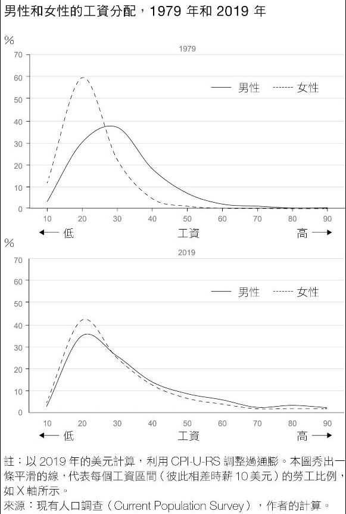

+++
title = "為什麼我們這一代男生感到空虛？——從《混沌少年時》到《男性廢退》"
date = 2025-04-07T20:10:55+10:00
categories = ["book"]
tags = ["性別"]
draft = false
showToc = false
summary = "我們追求性別平等，卻對一整代男孩正在崩潰的事實視而不見。教育挫折、職涯迷失、家庭角色轉變、情感需求失語——我們不是不夠努力，而是沒有人教我們該如何成為「現代的男性」。《男性廢退》不是一本為男人辯護的書，而是揭示我們這個社會正在集體忽略的困境。支持男性，不是否定女性；理解男性，是為了讓平等真正發生。"
+++

身為 2000 後出生的男生，在成長的過程裡，我其實一直感受到一種難以言喻的失落感與空虛感，正在壟罩我們這個時代的男性。我們感覺自己陷入了困境，但社會告訴我們，男性才是佔優勢的一方。「有毒男子氣概」一詞也將身為男性逐漸形塑成一種原罪。

「我覺得自己好像卡住了，但他們都說我沒問題。」

 *圖：《混沌少年時》劇照*

近期很熱播的 Netflix 影集《混沌少年時 Adolescence》，我覺得很精準的呈現了我們這個世代的心理狀態。很多人討論這部片中呈現的厭女現象，但更觸動我的是它反應出的**男性困境**。是這些沒有人認知到的困境，將男孩們推向有毒的男性圈（Manosphere）。

看完這部片之後，我深感震撼，並產生了更多的疑惑。為了更深入理解這背後的社會現象，我找來了這本《男性廢退》。

---

《男性廢退》這本書以大量的統計數據、實證研究，揭露了現代男性在教育系統、勞動市場、與家庭角色中的多重困境。

男生與女生的大腦發展速度是有天生差距的，使得青春期女生往往顯得比同齡男生更成熟。這樣的差異讓男生在學校常遭遇受大的挫折。在全球的多數已開發國家，女生完成大學學歷的比例已經超越男性許多，而且這個差距正在不斷擴大。

在職場上，統計數字仍告訴我們，男性與女性的薪資中位數差距了 12%。但若我們將薪資數據的分佈圖打開，會發現兩者圖形近乎完全相同。並不是同個工作男女的薪資不同，而是男女做的工作產業比例不同。但值得注意的是，男女在 30 歲以前的薪資成長是一致的，開始出現分歧是在夫妻生了第一個孩子之後開始。這說明了，職場的薪資不平等，現在最大的來源是家庭中的分工。

 *圖：男女薪資於 1979 與 2019 的分佈圖。取自書中*

然而傳統上男性為主的製造業、建築業、運輸業，因為自動化與全球化的影響造成大量失業。在未來 AI 的挑戰下，需要腦力但缺乏人際互動的職業也會受到威脅。相對的，女性為主的 HEAL 產業（健康、教育、行政、讀寫）的需求則是不斷成長（但有著低薪的困境）。

家庭中的角色，可以說是變化最劇烈的。在傳統家庭分工中，男性負責經濟的提供者，而女性負責照顧者。在現代，女性已經同時肩負了經濟提供者的角色，男性的角色卻沒有相應擴大。由於「經濟提供者」是男性的重要自我價值感來源，失業對男性心理健康的影響也遠超女性。

同時在約會市場中的均衡也發生改變：女性過去對男性有經濟依賴，而男性對女性有情感依賴。現在女性不再有經濟依賴，因此女性已經成為約會市場中較優勢的一方。這樣的現象，我們從交友軟體的設計（女生免費，男生付費）就能觀察到。

## 進步派與保守派的政治僵局

在性別議題已經日趨極端的現今政治氛圍下，關於男性困境的討論陷入了一種僵局。

進步派否認男性遭遇著困境的現實，忽視男女在生物學上的差異證據，也不承認男生在教育系統中的結構性劣勢。進步派認定性別不平等必定是單向的男性壓迫女性，而將男性面臨的困境都視為「個人的」、「心理的」問題。

「有害男子氣概一詞在這裡扮演了很重要的角色，因為它自然地將注意力集中在個別男性的性格缺陷，而不是結構性問題。如果男人很憂鬱，那是因為他們不會表達自己的感受；如果他們生病，那是因為他們不願意去看醫生；如果他們成績不好，那是因為他們不夠用功；如果他們早逝，那是因為飲酒、吸菸過量、飲食習慣差。因此，對那些政治左翼人士來說，如果對方是男性，那麼責怪受害者是被允許的。」

保守派認知到男性面臨的困境，但無法提出這個時代的解方，只想「倒轉時空」，想要重回到過去性別不平等的年代。他們承認但過度強調男女的生物學差異，並作為合理化不平等的理由。

「不再抱持幻想的男人，受到網路搜尋演算法的誘導，可能會逐漸陷入男性圈（Manosphere）之中，而這個圈子之中包含搭訕專家、非自願單身者（Incel）、甚至還有一些男性分離主義者——MGTOW。此時吃下「紅藥丸」的男人，開始組織起來、互相取暖，而且全部都痛恨女性主義者。紅藥丸一詞源自《駭客任務》（The Matrix），它跟一個抉擇有關：要不要看見真正的世界。而紅藥丸在這裡的意思是，認為我們的社會根本就沒有高壓父權，反而還被女性主義者支配，她們試圖誘騙和剝削男性。」

男性圈與非自願單身者，就是在《混沌少年時》中出現的重要議題之一。

進步派與保守派的政治僵局，演變成了日益極化的社會，而對於解決男性困境毫無助益。

## 解決方案

作者對男性的困境提出了三個面向的倡議：

- 教育：男孩比女孩晚一年上小學

- 勞動市場：推動更多男性參與 HEAL 產業

- 家庭：建立「父親友善」的社會制度

為了平衡男女在腦部發展的速度，作者提出讓男孩預設晚一年就讀小學（也就是 redshirting，披紅衫）。由一些研究中顯示，晚一年就讀小學，能有效提升男孩在學校中的表現，尤其在中學期間差異特別明顯。因此美國許多富裕白人家庭會刻意讓小孩延遲一年上學。然而，這個政策其實對於貧窮家庭的幫助會最大，但他們受限於經濟壓力，不一定能做到。

在勞動市場，我們應該鼓勵更多男性投入 HEAL 產業，並改善其男性從業者的污名化問題，並也為民眾提供更廣泛的服務提供者選項。有研究指出，在學校有男老師上課，會顯著提升男同學的成績，而對女同學也沒有不利影響。黑人男性教師對黑人男孩的幫助尤其重大，而他們現在只佔美國總教師的 2%。

過去數十年，推動女性參與 STEM 產業已取得了重大的成果。這些經驗可以幫助我們推動男性參與 HEAL 產業。具體方法包含提供更多 HEAL 產業教師、提供鼓勵男性進入 HEAL 產業的獎學金，與文化上改變社會對於從事 HEAL 產業男性的看法。

最後，則是對於家庭關係的改革。「父親」在家庭的角色需要轉型，從純粹的經濟提供者，變成「共同養育者」。這同時可以建立男性新的自我價值來源，以及減少女性在家中的不平等分工。父親與母親對於孩子教育也各自有其獨特的能力。有研究指出良好的父親關係，對於青春期的子女有相當大的正面影響。

然而要實現這個想法，不只是人們心態要改變，職場與政策也要同步改變。長久以來，每週工時 40 小時這樣的制度，就是設計給「有家庭主婦的男性」的。如果我們要讓家內的分工平等，就必須讓彈性的工時安排同樣是可能的。

作者提出的其中一個政策是，每當夫妻生了一位子女，夫妻雙方就會各有「獨立的」半年全額有薪假。注意這裡夫妻的假是各自計算的，妻子不能幫丈夫請他的半年假，因此就會變相鼓勵夫妻雙方共同養育小孩。

此外最重要的，還是要將心態從建立「職場友善的家庭」，轉為建立「家庭友善的職場」。縮短工時，增加排班彈性，讓夫妻同時工作並共同照顧小孩成為可能。

---

我在閱讀這本書的過程中，常常忍不住鼻酸。因為我意識到，這麼多年來，有無數人陷入困境卻從未被真正理解。而我自己長久以來的困惑與低潮，也許並不是脆弱或不夠努力，而是一種廣泛存在的集體經驗。

翻看書中的統計數據與研究案例，我逐漸明白：我們並不是不夠好，也不是不夠拼命，而是尚未在這個全新時代中，找到屬於自己的定位。這不該只是個人的功課，而是整個社會必須共同面對的課題。而理解——或許就是改變的第一步。

支持男性，從來不代表否定女性的努力與處境。性別平等不該是拉扯的零和遊戲，而應該是雙向的理解與共好。我們過去花了很多力氣去揭露女性在制度中的不公平，而現在，也該讓男性的困境能被看見、被理解。

當我們願意誠實面對每一種性別所承受的壓力與限制，性別平等才有真正往前的可能。