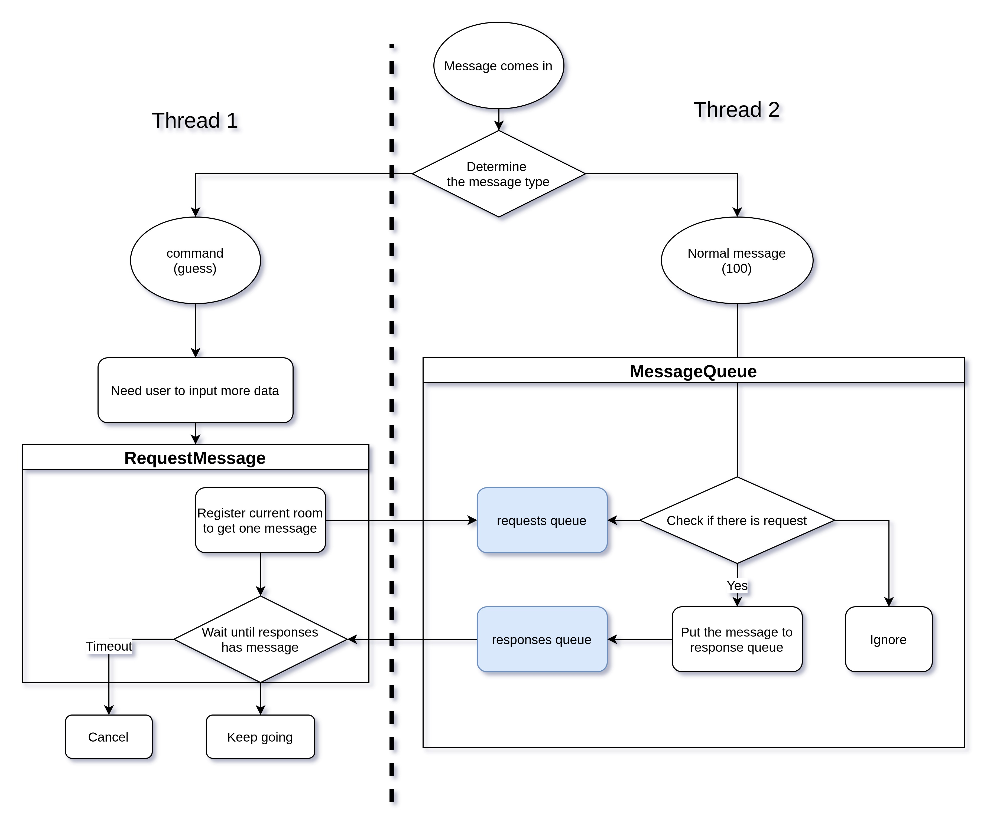
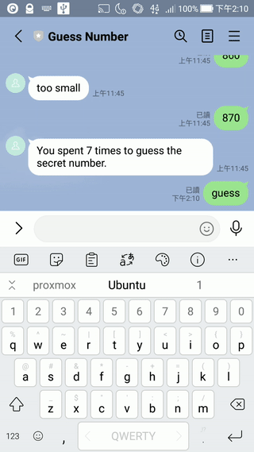

+++
title = "How to Handle Conversation in Chatbot in Python"
date = 2021-07-29T16:13:36+08:00
categories = []
tags = ["Python", "Chatbot"]
draft = false
showToc = true

+++

When you develop a chatbot, sometimes for user experience, you cannot ask your user send messages like  commands. For example, we want to build a guess number bot. We want the bot works like this:

> **user:** guess  
> **bot:** From what number?  
> **user:**: 25  
> **bot:** To what number?  
> **user:** 100  
> **bot:** Guess a number between 25 to 100  
> **user:** 64  
> **bot:** too small  
> **user:** 91  
> **bot:** too large  
> ......  
> **user:** 83  
> **bot:** Correct! You spent 6 times to guess this number.

However, the common way we dealing with requests in the backend is one-request-one-response. That would be a disaster to separate a lot of handlers from the conversation. Why? Think about how to store the states? In global variables? Or database? Or Redis? Once you ask users one more question, you need to change the schema of your state, and the code becomes more complex. 

In the following, I will show you how to deal with conversations and write the handler in a simple and straightforward way like this:

```python
    def guess(self):
        '''Game function'''
        min_value = self.ask_number('From what number?')
        max_value = self.ask_number('To what number?')
        secret = randint(min_value, max_value)
        msg = f'Guess a number between {min_value} to {max_value}'
        counter = 0
        while True:
            counter += 1
            answer = self.ask_number(msg)
            if answer > secret:
                msg = 'Too large'
            elif answer < secret:
                msg = 'Too small'
            else:
                break
        self.reply(f'You spent {counter} times to guess the secret number.')
```

I will write a LINE bot for example, but it doesn't matter what platform you develop to. I will use Django and it's okay if you use other frameworks.

## Setup Environment

It's for setting up the bot, you can skip this if you know it.

Clone my repo:

```bash
git clone https://github.com/lancatlin/python-chatbot-context.git
cd python-chatbot-context
pipenv install
pipenv shell
```

Go to [LINE Developers](https://developers.line.biz) to create a bot. Issue the token and your secret, put them in a `.env` file.

```bash
LINE_TOKEN=YOUR_TOKEN
LINE_SECRET=YOUR_SECRET
```

Then start Django.

```bash
python manage.py migrate 	# for first execution
python manage.py runserver
```

Use Ngrok or something similar to tunnel the localhost:8000 to a public endpoint, and register the URL to LINE Messaging API.

## Idea Describe

###### 

The main idea is to block the command thread until another message is received. When the program receives the 'guess' command, it will be executed in the command thread. Once the program needs input from the user, it put a message in the room's "requests queue". Then when the message comes in at another thread, it checks the room's requests queue and puts the message in the responses queue if not empty.

## Implement

We implement it as `MessageQueue` class:

```python
# guess/message_queue.py
import queue
from threading import RLock
from .line import get_room


class RequestTimout(Exception):
    pass


class MessageQueue:
    __lock = RLock()
    __requests = {}
    __responses = {}

    @classmethod
    def create_if_not_exists(cls, room):
        '''Create the requests and responses queues for the room if not exists'''
        with cls.__lock:
            if room not in cls.__requests:
                cls.__requests[room] = queue.Queue(maxsize=1)

            if room not in cls.__responses:
                cls.__responses[room] = queue.Queue(maxsize=1)

    @classmethod
    def handle(cls, event):
        '''Handle the message, check whether there is room request for'''
        room = get_room(event)
        cls.create_if_not_exists(room)

        try:
            if not cls.__requests[room].empty():
                cls.__responses[room].put(event, timeout=1)
                cls.__requests[room].get()
                return True
            return False
        except queue.Empty:
            '''No request, ignore the message'''
            return False

    @classmethod
    def request(cls, room, timeout=30):
        '''Request a message, block until message comes in or timeout'''
        try:
            cls.create_if_not_exists(room)

            cls.__requests[room].put_nowait(True)
            return cls.__responses[room].get(timeout=timeout)

        except queue.Empty:
            MessageQueue.clear(room)
            raise RequestTimout

    @classmethod
    def clear(cls, room):
        '''Clear the requests'''
        cls.create_if_not_exists(room)
        try:
            cls.__requests[room].get_nowait()
        except queue.Empty:
            pass

```

With this, we can implement our guess app very easily.

```python
# guess/guess.py
from .message_queue import MessageQueue, RequestTimout
from .line import reply_text, get_room, get_msg
from random import randint


class Guess:
    '''Guess handle a guess number game'''

    def __init__(self, event):
        self.event = event
        try:
            self.guess()
        except RequestTimout:
            self.reply('Timeout')

    def guess(self):
        '''Game function'''
        min_value = self.ask_number('From what number?')
        max_value = self.ask_number('To what number?')
        secret = randint(min_value, max_value)
        msg = f'Guess a number between {min_value} to {max_value}'
        counter = 0
        while True:
            counter += 1
            answer = self.ask_number(msg)
            if answer > secret:
                msg = 'Too large'
            elif answer < secret:
                msg = 'Too small'
            else:
                break
        self.reply(f'You spent {counter} times to guess the secret number.')

    def ask(self, *msg):
        '''Ask a question to current user'''
        self.reply(*msg)
        self.event = MessageQueue.request(get_room(self.event))
        return get_msg(self.event)

    def ask_number(self, *msg):
        '''Ask a number, if not number, ask again'''
        try:
            content = self.ask(*msg)
            return int(content)
        except ValueError:
            return self.ask_number('Please input an integer.', *msg)

    def reply(self, *msg):
        '''Reply words to user'''
        reply_text(self.event, *msg)

```

You can see the main function is straightforward, with only 17 lines of code. What's more, it can handle multiple user inputs at the same time.



Get full code on [GitHub](https://github.com/lancatlin/python-chatbot-context).

Special thanks to [YukinaMochizuki](https://github.com/YukinaMochizuki) for giving me the initial idea from [his Notion bot project](https://github.com/YukinaMochizuki/DCDos).
