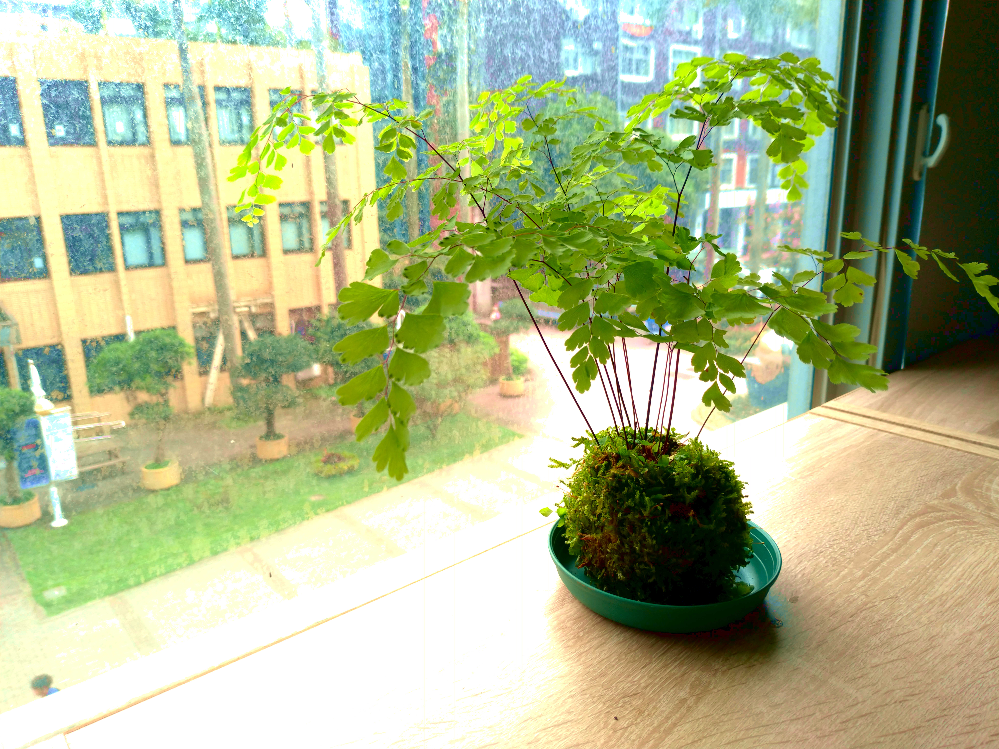

+++
title = "減法的藝術"
date = 2021-04-18T09:23:46+08:00
categories = ["散文"]
tags = []
draft = false
showToc = false
summary = "這時我才終於體會了老師口中的「有捨才有得」，若無狠心除去那些無關的枝葉，最可貴的美就會被埋沒。園藝是如此，創作又何嘗不是呢？"
+++

*照片自攝於教室*

記得小時候父母起的一個綽號——愛力信，起因是一次在整理花園時，我對一株長得碩大的雜草於心不忍，跟父母爭執不要將它砍除，因為就算它是雜草，也帶有它的美，何況它是如此努力才長到這麼大的，怎麼能這樣輕易的將它砍除呢？父母見我對一株植物也能有如此感情，誇我很有同情心，還給了我「愛力信」這個稱號。

長大後，也許是早已習慣環境中的生死，也許是在狠心後變得麻木，我已不像兒時會對一草一木抱持慈悲心，鐮刀斬斷的草、鋤頭碾死的蚯蚓，在我看來都是如此遙遠。而此時的我，著迷於音樂創作，在電腦螢幕上拉出一個個音符，創作屬於自己的音樂。然而我雖能寫出些不錯的旋律，配器之間的搭配卻不協調，宛如一座雜草叢生的花園，看得見些許美麗花朵，卻被雜草埋沒而缺乏營養。但我念於每段旋律都是自己的心血結晶，而狠不下心砍掉重寫。

這學期的國文課，其中園藝與人生的課程，老師請來了園藝老師來帶我們體驗園藝，讓每個人做一株鐵線蕨苔球。作法是將青苔片裁成適當大小後，包覆到移出盆栽的鐵線蕨上面。當我將鐵線蕨包上了青苔後，便對其感到滿意，認為已經足夠「美」了。然而老師接下來卻要我們修剪枝葉，把許多甚至十分鮮嫩的枝條剪掉。我原先感到抗拒，畢竟這已是它「自然之美」了，何必多用這些「人工」的手段去破壞它呢？但我還是照做了，仔細摘除底部的枯葉與雜草，狠下心修剪弱小的枝條，只留下最強壯、最健康的莖幹。

當我終於停下了剪刀，仔細端詳我的心血，我對其之美感到驚豔——圓潤的苔球中，數根烏黑、纖細的枝條挺立，而輕柔的葉子自在的隨風搖擺，不像先前擠成一團，底部雜亂無序。這時我才終於體會了老師口中的「有捨才有得」，若無狠心除去那些無關的枝葉，最可貴的美就會被埋沒。園藝是如此，創作又何嘗不是呢？

「創作，是減法的藝術」，剛開始時總是會冒出許多想法，在思想的花園恣意綻放，然而若不根據我們的目標，修剪掉那些不適合的內容，我們最後將無法成就那心目中的傑作。