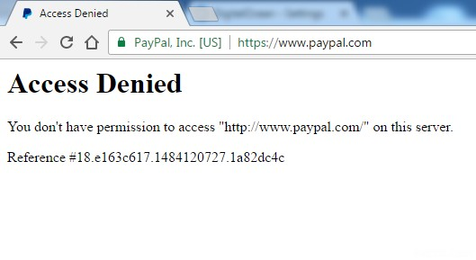
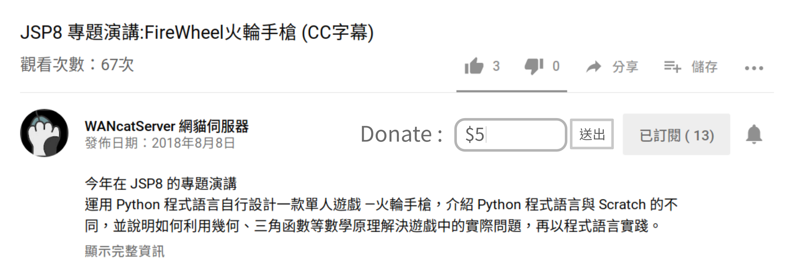
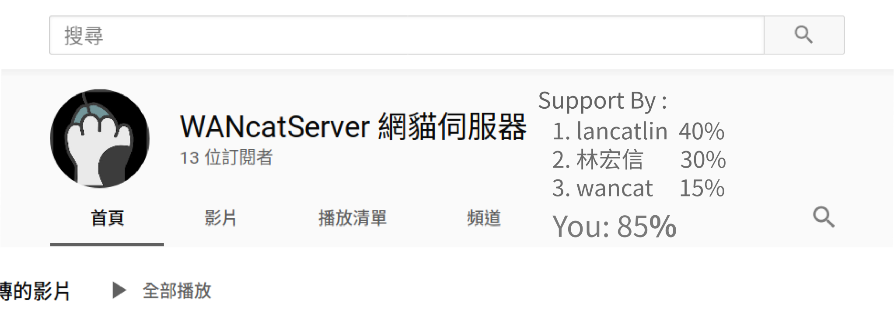

+++
categories = ["評論"]
date = "2019-03-25 17:22:22"
tags = ["商業模式", "讚賞經濟"]
title = "SITCON 演講：軟體開發的未來，是大斗內時代？"

+++

# 2019 SITCON 演講：軟體開發的未來，是大斗內時代？

## 前言

我參加了 2019 在中研院舉行的 [SITCON](https://sitcon.org) 學生計算機年會，並投稿了一篇 Espresso 短講，以下是我的演講稿：

## 講者介紹

大家好，我是林宏信，現在是國中三年級。我從小六開始接觸 Scratch，國二開始學習 Python，目前正在學習 Go Web 開發。我的興趣是寫程式、寫音樂、寫文章，經營部落格 **WANcatServer 網貓伺服器** ，歡迎大家去看看喔！。  

今天要跟大家分享的是 **我們如何靠軟體賺錢**，相信在台下的大多數人，包括我，都喜歡寫程式，那你是否思考過，我們該如何靠軟體賺錢呢？畢竟這攸關生計，是個很重要的問題。  

## 軟體難以賺錢
雖然軟體工程可說是現代社會最熱門的行業之一，但事實上「純靠軟體賺錢」是一件很難的事。當然，今天如果你受雇於公司，公司付薪水請你寫軟體，那沒什麼困難。但如果今天你要將手頭上的軟體換成錢，可不是那麼容易的事。  

### 拷貝發大財
也許今天你寫了一個很好玩的遊戲，你想要賣給別人玩，你將它打包成 binary，找到買家，收了錢將軟體寄給他，但也許他就直接將你的軟體發布在網路上免費供人下載，你後面的生意都不用賺了。  

憑什麼？根本原因在於**軟體是一項「0 邊際成本」的產品**。  

### 邊際成本
邊際成本是經濟學的名詞，意思是 **「增加一單位產品所需要的成本」**，生產一台汽車的成本高昂，但生產第 10000 台汽車的成本就低的多。  

軟體開發絕不是無本生意，從設計、開發到產品做出來都需要大量的時間、金錢、人力成本。0 邊際成本，一方面可以將產品賣給更多人，但另一方面所有拿到軟體的人都有「拷貝的能力」，隨時可以破壞你的生意。  

不只是軟體，現在所有的創作媒介：文字、影片、音樂，幾乎都是 0 邊際成本的產品，各式各樣的創作也無法逃離「被拷貝」的命運。為了擋住這波拷貝攻勢，政府定了許多著作權法規、DRM 來規範。但事實上，Who cares? 大家還不是複製得很爽？  

那該怎麼辦？與其讓心血被別人拿去散佈，不如 **我們自己將它「免費」**。  

## 免費時代崛起
如果我們要完美結合軟體 0 邊際成本的特質，最有效方式就是「免費」，並另找方式獲利。明顯的例子就是廣告業的崛起。  

### 消費者轉為生產者？
記得我小時候剛開始用電腦，Windows 要錢，Office 也要錢，買遊戲也要錢，花錢好像理所當然。但當我開始上網後，發現 Google 是免費的、Facebook 是免費的、YouTube 也是免費的。我相信做 Facebook 絕不會比 Windows 簡單，那為什麼 Windows 要收錢，而 Facebook 不用呢？  

原因在於使用者對公司的價值。  

在網際網路尚未普及前，使用者與軟體公司就是單純的消費供給關係，使用者花了錢買到軟體就拍拍屁股走了，不會帶給軟體公司任何附加價值，所以軟體公司必須收費。（除了用 Word 檔征服全世界）  

而當網際網路開始蓬勃發展後，事情就不同了。一個使用者對 Facebook 而言，是賺錢的工具！他不只能提供自身的資料，還能鼓勵周圍的親朋好友一起使用。因為使用者對 Facebook 有價值，所以採免費的商業模式來拉更多的使用者，是最有效率且最賺錢的方式。  

### 流量至上主義  
但廣告收益模式卻引發了一波隱私危機：越了解消費者，就代表能投放越精準的廣告。於是使用者的資料開始增值，Google、Facebook 等公司開始搜刮用戶資料，突然間，這些大公司已經比你的家人更了解你。  

而廣告收益模式，通常也意謂著：消費者不需要喜歡它，只要把它們吸引過來就好。因此聳動的、有爭議的，反而能引起比較大的討論度，從而創造更大的收益。媒體業開始不重視質量，只追求三量大：**產量大、流量大、討論量大**。  

漸漸的，創作者與消費者也開始厭惡這樣的「免費」商業模式，試圖從「付費」找到新的方向。  

---

## 新付費方案
隨著對廣告商業模式的不滿日積月累，許多新的專案在**線上支付**的幫助下，開始出現新的商業模式。  

### 多虧了線上支付
想像今天你不能用任何形式的線上付款：信用卡、PayPal、加密貨幣，所有在網路上的消費都必須到超商付款，那你可能會盡量減少網路上的消費，畢竟真的挺麻煩的。  

如果沒有方便的線上付款，我們可能根本不會在網路上買電影、買音樂、買遊戲，因為付款的時間成本太大，讓我們覺得不划算。  

就是因為有線上支付，現今網路上各種付費方案才能成功，一旦付款的成本大於尋找盜版的成本，使用者很可能就會轉而使用盜版。  

有個例子就是我捐款支持一個開源遊戲 0 A. D. 的經驗，我很喜歡它，有天玩完後覺得很感動，就點了遊戲主頁的「贊助」，然後呢？我花了半個小時還是捐不出半毛錢，我的電腦被 PayPal Access Denied，我爸的信用卡因此被封鎖，結果花了半個小時仍捐不出去，我就不想捐了。  

由此可知方便的線上付款有多重要。  

### 現行的付費方案
現在最普遍的方案就是 Web + 帳號制，分成免費帳號和付費帳號，像是 GitHub、Medium、Pocket。較為常見就不多做說明。  

而現在也有個看似不可能的商業模式正在崛起，就是我們今天的主角 —— **大斗內時代**。

## 大斗內時代
「斗內」一詞源自於英文的 Donate，意思是捐款。從蠻久以前，就有很多網站上面會放 Donate 或是 Buy me a coffee 連結，讓看了網頁覺得感動或是喜歡的人，有個方式支持作者。  

我將這樣「免費使用、付費支持」的模式稱為**斗內模式**。不只網站，各個開源專案像是 GNU、ArchLinux、Firefox，也都是採取斗內模式。  

### 案例研究：Twitch

我今天要介紹一個經典的斗內模式案例，就是直播平台 Twitch。

在 Twitch 上達成條件的直播主，可以讓觀眾透過給予代幣 -- 小奇點，或是 **付費訂閱** 來獲得收入。在 Twitch 上的直播，都是公開給所有觀眾觀賞，因此符合「免費使用、付費支持」的原則。  

在 Twitch 上給予小奇點，用戶不需要離開 Twitch，減少付款不便帶來的損失。使用代幣，也可降低用戶「付款的痛苦」。  

更重要的是，Twitch 上的收益模式，比起 YouTube 等平台更直接，讓願意支持創作者的用戶有直接而方便的管道。  	

### 斗內收益模式的真正價值
我認為，採取斗內的最大好處在於：我們不需要迎合所有人。跟廣告收益模式不同，斗內只需要有一群願意持續支持你的觀眾，這個數量或許一兩萬就十分足夠；但廣告模式卻需要不停尋找新的客群，有時為了吸引更多人，就喪失了自己的初衷。  

斗內模式讓小眾的內容更容易生存下去，創作者的重點是培養一群有感情的觀眾，不必要去迎合大眾口味，迎合所有人。簡單來說，**只要讓喜歡你的人喜歡就好，而不用讓所有人喜歡你**。

想像一下，如果今天每個 YouTube 影片下都有一個 Donate 按鈕，填寫金額後立刻送出，可以在 YouTuber 頻道頁面可以看到排名前幾的「大股東」，看到自己佔了多少「股份」，並且努力將自己支持的 YouTuber 推向高峰，是不是非常有趣呢？  

斗內，就是在網路上的 **「街頭藝人」**，他免費提供表演、服務、產品，如果你願意，就留下金錢作為報償。在紐約時代廣場的街頭藝人一個小時可以賺台幣 600 元，那如果在能觸及更多人的網路呢？這些免費的內容就是你自身最好的廣告，為你累積名氣，幫你找到更大的機會。  

只要線上小額付款，能做的像把銅板丟進帽子裡一樣方便，有一天，要靠著斗內活下去不是不可能。  

## 結語：我到底幹嘛寫軟體？
所以我幹嘛寫軟體？寫軟體多麻煩，又困難，又不知道怎麼賣？還不如做硬體，至少硬體不會被無限量拷貝。  

在我國二的時候，我同時在學 Python 以及 Arduino，那個時候兩個其實都算做的不錯，但後來我就放下了硬體，把 Arduino 收進暗無天日的櫃子裡，專心寫軟體。  

為什麼？因為我發現，當我完成一個 Python 專案時，我可以將它傳給我的朋友，我可以把它發布在網路上，跟所有人分享。而當我完成 Arduino 後，別人需要擁有相同硬體才可使用，我只能孤芳自賞，頂多拍影片上傳到網路上，沒辦法與人一同分享它。  

**就是因為拷貝！** 就是因為軟體可以無限的拷貝，我們才會遇到那些難題，但 **我們也因此才能將自己的心血向全世界分享，才會有自由軟體，才會有 Linux！**  

>  **而分享，才是做軟體最大的樂趣。**

## 參考資料
書籍：柯利．多克托羅 ── 資訊分享，鎖得住？

- [WikiPedia 邊際成本](https://zh.wikipedia.org/zh-tw/%E8%BE%B9%E9%99%85%E6%88%90%E6%9C%AC)
- [從付費到免費再到補貼 ── 商業模式變遷的底層邏輯](https://www.inside.com.tw/article/14530-payment-to-freemium-to-subsidies) 
- [囧星人 ─ 盜版的未來 ｜ 資訊分享，鎖得住？](https://www.youtube.com/watch?v=f-xhJVy5aMc)
- [Everything You Need to Know About Twitch Subscriptions ](https://www.lifewire.com/twitch-subscriptions-4147319)
- [Twitch 夥伴方案](https://www.twitch.tv/p/zh-tw/partners/)
- [Twitch 實況盟友方案](https://affiliate.twitch.tv/zh-tw/)
- [使用小奇點 Cheering 指南](https://help.twitch.tv/s/article/guide-to-cheering-with-bits?language=zh_TW)