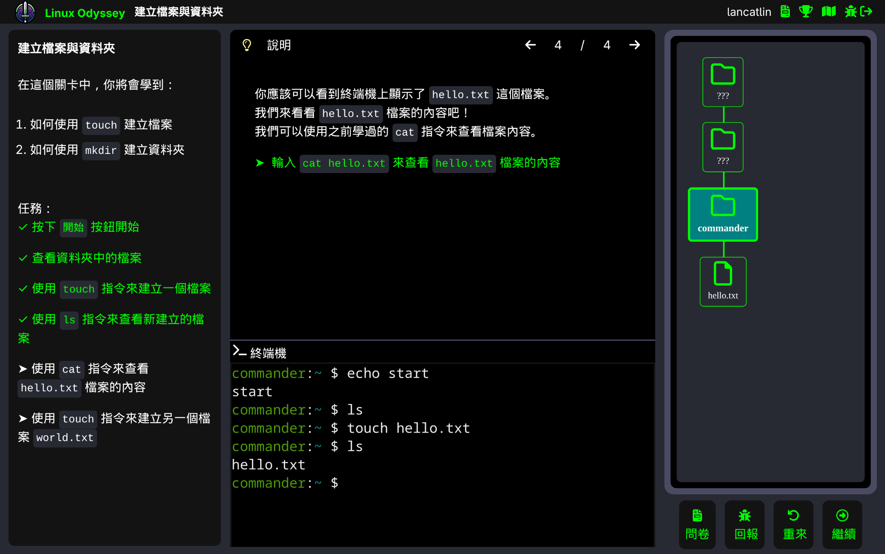
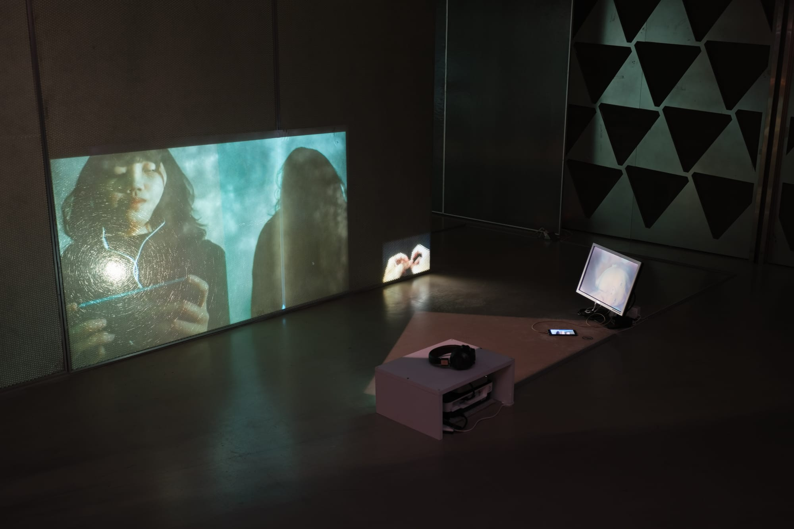
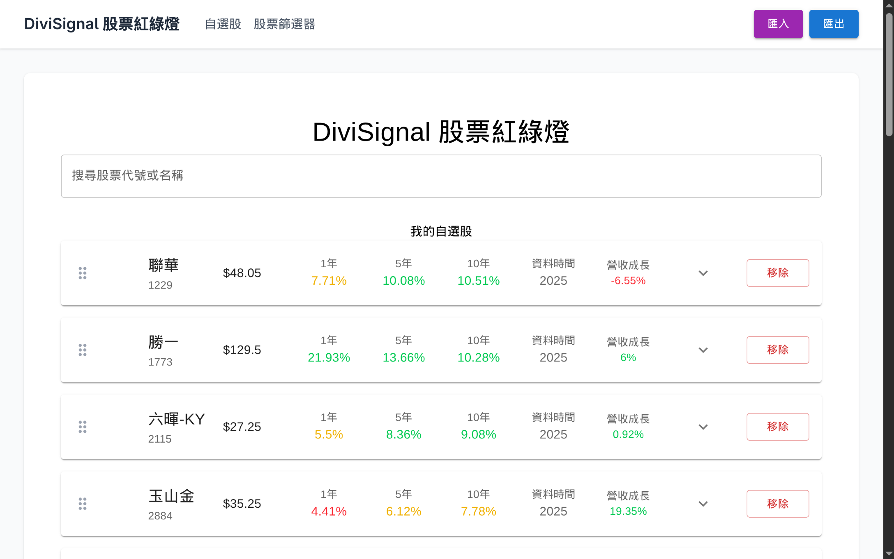

+++
showToc = false
title = "Projects"
+++

## [Linux Odyssey](https://linuxodyssey.xyz) 

2023 - 2024

My graduation project. An interactive terminal learning platform that provides guided courses, visual file tree functionality, and error message guidance.
Each course creates a container on the server side for user interaction.

Stack: TypeScript, Vue, Express, WebSocket, Docker in Docker  
License: GPL

[GitHub](https://github.com/linux-odyssey/linux-odyssey)

---

## Synchan

2024 - 2025

[Image: Lin Pei-Yao. Triangular Relationship / Three-Channel Loop Video / 03'39" / 2021](https://peiyao.run/2024-the-dual-double-channel/)

Multi-channel video synchronization tool that works across devices and platforms, with mobile support.

Used in [Lin Pei-Yao Solo Exhibition: The Dual Double-Channel (2024)](https://peiyao.run/2024-the-dual-double-channel/)

Stack: TypeScript, React, tRPC, WebSocket

Currently available by invitation only. For inquiries, please contact wancat@wancat.cc

---

## [DiviSignal Stock Traffic Light](https://divi-signal.pages.dev/)

2025

Stock traffic light analysis tool. Supports dividend yield calculations, import/export of watchlists, and stock filtering by yield.

Stack: TypeScript, React, Redux, Cheerio, Cloudflare Worker
