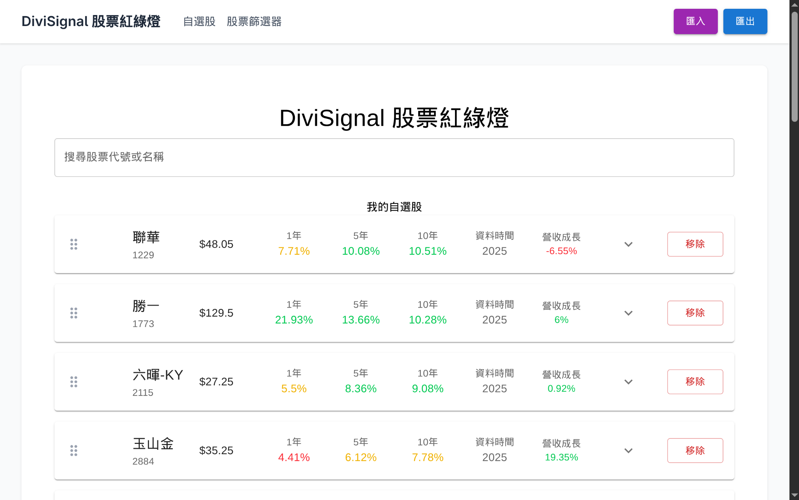

+++
showToc = false
title = "我的專案"
+++

## [Linux Odyssey](https://linuxodyssey.xyz) 

2023 - 2024

我的畢業專題。互動式終端機教學網站，提供導引式的課程，視覺化檔案樹功能，及錯誤訊息引導。
每個課程都會在伺服器端建立一個容器讓使用者操作。

Stack: TypeScript, Vue, Express, WebSocket, Docker in Docker  
License: GPL

[GitHub](https://github.com/linux-odyssey/linux-odyssey)

---

## Synchan

2024 - 2025

[圖：林沛瑤。三角關係／三頻道循環錄像／03’39”／2021](https://peiyao.run/2024-the-dual-double-channel/)

多頻道影音同步播放工具，可跨裝置、跨平台，支援手機。

使用於[林沛瑤個展 雙頻道 The Dual Double-Channel (2024)](https://peiyao.run/2024-the-dual-double-channel/)

Stack: TypeScript, React, tRPC, WebSocket

目前僅開放邀請試用。有興趣請來信 wancat@wancat.cc

---

## [DiviSignal 股票紅綠燈](https://divi-signal.pages.dev/)

2025

股票紅綠燈分析工具。支援股利報酬率計算，匯入匯出自選股，依殖利率篩選股票。

Stack: TypeScript, React, Redux, Cheerio, Cloudflare Worker
